# ADR-0039: Operator MCP V2 — quote mutation governance

## Status

Accepted.

## Context

Operator MCP V1 (ADR-0036 amendment #2) shipped 14 read + safe-comm + analytics tools (search, send wizard/quote/document/FNOL links, UW queue, sales stats). The two highest-value flows from the original spec — A3 "update John Doe's quote: excess 400→750 + add VIP roadside assistance" and B3 "create an address-change endorsement for Jane Black" — were deferred to V2 because they mutate canonical configuration and require a governance contract V1 did not have.

This ADR is that contract.

The exploration that informed this decision found three pre-existing seam gaps the V2 implementation has to close before any mutation tool ships:

1. **No backend caller of `validateForContext({ actor: 'underwriter' })`.** Today the validation runtime is invoked with `actor: 'server'` (rating-stage gate in [`backend/modules/quotes/app/validatorImpl.ts`](../../../backend/modules/quotes/app/validatorImpl.ts)) or `actor: 'customer'` (frontend wizard). The `underwriter` actor is referenced only from frontend code ([`frontend/src/modules/policies/services/validateQuoteData.ts`](../../../frontend/src/modules/policies/services/validateQuoteData.ts)). Operator MCP V2 patches arrive from an authenticated remote agent — that's a `'underwriter'`-grade actor. The backend has no canonical writer that calls the validator with this actor today.

2. **Draft-save paths skip pre-write validation.** [`updatePublicAutoDraft`](../../../backend/products/motor/quotes/service.ts), [`uwRouter:updatePolicyUwFormHandler`](../../../backend/modules/policy/http/uwRouter.ts), and [`genericPublicQuoteRouter.PATCH /:token`](../../../backend/modules/quotes/http/genericPublicQuoteRouter.ts) all merge-and-persist without calling `validateForContext` before write. The rating step (`validateDraftQuote`) catches errors later, but by then `quoteData` is already mutated. For operator MCP V2 — where the LLM is the patch author — pre-write validation is non-negotiable.

3. **No preview-then-confirm pattern.** BO "Send quote" commits immediately ([`PremiumActions.tsx`](../../../frontend/src/modules/policies/premium/actions/PremiumActions.tsx) → `handleIssueQuote` → `api.sendQuote(policyId)`). For the agent-driven flow the spec requires showing the operator a diff + premium delta + confirmation prompt before commit. No existing flow does this.

V2 has one architectural commitment locked from the planning stage: **full free-text quote-data patch surface** (not a curated whitelist). The agent can change any wizard field; safety comes from the validation + rating round-trip on every patch, not from restricting the input shape. This commitment shapes every section below.

## Decision

### 1. The mutation pipeline is preview-then-confirm

Every `operator.*` tool with `auditClass: 'mutate'` either RETURNS a `confirmation_token` (preview tools) or REQUIRES one (committing tools). The store is `backend/modules/mcp/infra/confirmationTokenStore.ts` — Redis SET+TTL via the existing [`webhookReplayGuard`](../../../backend/platform/security/webhookReplayGuard.ts) pattern; 10-minute TTL; single-use redemption (GET + DEL); cross-actor redemption rejected.

```mermaid
flowchart LR
    Fork[operator.fork_quote] --> Patch[operator.update_quote_terms]
    Patch -->|"validateForContext underwriter"| ValGate{valid?}
    ValGate -->|"no"| RetErr[validation errors envelope]
    ValGate -->|"yes"| Rate[operator.rate_quote]
    Rate --> Preview[operator.preview_quote_send]
    Preview -->|"evaluateIssueReadiness"| IRGate{can issue?}
    IRGate -->|"no"| RetIR[readiness blockers envelope]
    IRGate -->|"yes"| Token[confirmationTokenStore.put 10min TTL]
    Token --> RetPreview[OperatorPreviewEnvelope with token + diff + premium]
    RetPreview --> Confirm[operator.send_revised_quote with confirmation_token]
    Confirm -->|"token.actorId == ctx.userId?"| Save[saveQuoteVersion]
    Save --> Send[sendRevisedQuoteUseCase]
```



The fork → patch → rate → preview → save → send sequence is exposed as six distinct tools (not folded) so the agent surfaces intermediate state to the human operator. Same workflow shape as a BO operator clicking through the Premium tab.

### 2. The single validation seam — `applyQuotePatchUseCase`

V2 introduces `backend/modules/policy/app/quoteLifecycle/applyQuotePatchUseCase.ts` as the new canonical writer for operator-MCP patches. Pipeline:

1. Load current `Policy.quoteData` + `productType`.
2. Deep-merge the patch.
3. Call `validateForContext({ productCode, stage: { kind: 'stage', id: 'quote' }, actor: 'underwriter', data: merged })` — **the seam this ADR adds to the backend**.
4. If validation errors → return them; no writes.
5. If valid → call `normalizeUwDataForProduct` (preserves canonical normalisation).
6. `assertBinderAuthorizesProduct` against the merged data.
7. Persist via the same transactional shape as today's `uwRouter:updatePolicyUwFormHandler`.

Both `uwRouter` and the new operator MCP tool dispatch through this single service. The `actor` parameter on the input differentiates:
- `role === 'OPERATOR_AGENT'` — validation runs strictly (operator MCP V2 commitments).
- `role === 'UNDERWRITER'` — validation runs in **warn-only mode** (logs `operator.validation.warn` but does not block). This preserves BO behaviour pinned by existing tests; V3 will flip BO to strict once warn-only telemetry shows it's safe.

### 3. Service extractions (UI behaviour preserved)

Five canonical services extracted from inline writes. Each is "lift the inlined logic into a callable function, BO route becomes a thin caller, operator MCP also calls it". Same writes, same audit, same outbox; UI behaviour pinned by existing `usePolicyLifecycleActions.test.tsx`, `PremiumPricingBreakdown.test.tsx`, `motor/quotes/service.test.ts`, and `test:contracts-fast` 58/58.

| Service | New file | Wraps existing inline write |
|---|---|---|
| `forkQuoteWorkspace` | `backend/modules/policy/app/quoteLifecycle/forkQuoteWorkspace.ts` | [`quoteHistoryRouter.ts:POST /quote-history/archive`](../../../backend/modules/policy/http/quoteHistoryRouter.ts) |
| `applyQuotePatchUseCase` | `backend/modules/policy/app/quoteLifecycle/applyQuotePatchUseCase.ts` | [`uwRouter.ts:updatePolicyUwFormHandler`](../../../backend/modules/policy/http/uwRouter.ts) |
| `rateQuoteUseCase` | `backend/modules/policy/app/quoteLifecycle/rateQuoteUseCase.ts` | Thin dispatcher: motor → [`service.ts:rateQuote`](../../../backend/products/motor/quotes/service.ts); non-motor → [`quoteRateService.ts:ratePolicyAndPersist`](../../../backend/modules/quotes/app/quoteRateService.ts) |
| `sendRevisedQuoteUseCase` | `backend/modules/policy/app/quoteLifecycle/sendRevisedQuoteUseCase.ts` | [`quoteRouter.ts:POST /:id/quote/send`](../../../backend/modules/policy/http/quoteRouter.ts) |
| `executeCreateEndorsementDraft` (already exists) | [`backend/modules/policy/app/CreateEndorsementDraft.ts`](../../../backend/modules/policy/app/CreateEndorsementDraft.ts) | n/a — operator tool calls the existing service |

V1's `leadDelegate` and `claimDelegate` stay. The V2 refactor is V2-tools-only; the V1 tactical bypass is documented as out-of-scope here.

### 4. Permission policy

`OPERATOR_AGENT_OPTIONAL` gains `'operator.mutate'` (already declared as a reserved row in V1 `permissionTaxonomy.ts`). Per-key opt-in at issuance — the BO operator issuing the key must themselves hold `operator.mutate` (defense-in-depth, same posture as V1 `publish_sandbox`). V1 BO keys without the opt-in cannot call any V2 mutation tool; `authorizeToolCall` rejects with `UNAUTHORIZED` and `tools/list` filters the tool out entirely.

### 5. Audit event vocabulary

`AuditEventType` (TS union in [`backend/platform/audit/logger.ts`](../../../backend/platform/audit/logger.ts)) gains:

```
OPERATOR.QUOTE_PATCH_APPLIED
OPERATOR.QUOTE_RERATED
OPERATOR.QUOTE_PREVIEW_GENERATED
OPERATOR.QUOTE_REVISION_SAVED
OPERATOR.QUOTE_REVISION_SENT
OPERATOR.ENDORSEMENT_DRAFT_CREATED
OPERATOR.ENDORSEMENT_LINK_SENT
OPERATOR.ENDORSEMENT_SUBMITTED_FOR_REVIEW
```

Each tool emits one canonical event on success. The diff payload always carries `{ confirmationToken: <hash> | null, inputHash, sessionId, correlationId }` so a Lloyd's audit can replay the full mutation chain from `actorId = apikey:<id>`.

### 6. New guards

- `tools/quality/check-operator-mutation-preview-required.mjs` — every operator MCP tool whose `auditClass === 'mutate'` MUST either return `{ status: 'preview', confirmation_token }` OR accept a `confirmation_token` input parameter. Pins the preview-then-confirm contract at static analysis time.
- `tools/quality/check-operator-validate-on-patch.mjs` — `applyQuotePatchUseCase.ts` MUST import `validateForContext` from `@facio/validation/backend` AND call it before any persist. Pins the seam.

Both register in [`package.json`](../../../package.json) and run in the build:api chain.

## Forbidden

- Any `operator.*` mutate tool that commits without consuming a `confirmation_token`.
- Any backend code calling `validateForContext({ actor: 'underwriter' })` outside `applyQuotePatchUseCase.ts` (single seam). Frontend usage unchanged.
- Confirmation tokens stored anywhere other than the canonical store (`backend/modules/mcp/infra/confirmationTokenStore.ts`). No per-tool ad-hoc Redis keys.
- Direct writes to `Policy.quoteData` from `backend/modules/operator/` — every patch funnels through `applyQuotePatchUseCase`.
- Endorsement *binding* (status `REFERRED → APPROVED → BOUND`) from any operator MCP tool. V2 only creates DRAFT and submits for review. Binding stays with the canonical BO endorsement flow.

## Consequences

- One new module + one extension layer; no Prisma schema changes.
- BO behaviour preserved by the warn-only validation flag and the extraction discipline (same persistence, same audit, same outbox).
- The agent-facing mutation surface is wide (any wizard field) but the safety surface is also wide (validation + binder authority + UW automation + issue-readiness all run per patch). The constraint is implicit and machine-enforced rather than restrictive at the input shape.
- Customers (Lloyd's MGAs) get a single audit chain per agent key spanning preview, patch, save, and send — replayable from the `OPERATOR.*` rows.

## Alternatives considered

- **Curated whitelist of mutable fields.** Smaller blast radius, but every customer ask for a new editable field becomes a code change. Full free-text + canonical validation gates was chosen because it scales with the validation contract, not the operator team's release cadence.
- **Skip the preview step; commit immediately like BO.** Rejected: an LLM patch is structurally different from an underwriter click — the operator needs to see what the LLM is about to do before it happens. The preview is also the natural place to surface premium delta and issue-readiness blockers in one envelope.
- **Store confirmation tokens in Postgres.** Rejected for V2: tokens are short-lived (10 min), single-use, and high-volume — Redis SET+TTL matches the shape exactly. The `webhookReplayGuard` precedent is already in the platform.

## Out of scope

- OAuth 2.1 (V3 — ChatGPT Apps Store distribution).
- Per-key rate limiting (V3 — when a customer key starts being abusive).
- Flipping BO `uwRouter` to strict `validateForContext({ actor: 'underwriter' })` (V3 — guided by warn-only telemetry).
- Coverage-changing endorsements via endorsement instance (V3 — adds excess endorsements, MBE-driven coverage changes).
- V1 `leadDelegate` / `claimDelegate` extraction into proper `policy/app/operatorWrites/*` services (when technical-debt cost outweighs refactor cost).

## Links

- Parent + V1 amendment: [ADR-0036](./ADR-0036-config-mcp-module-and-tool-surface.md) (+ amendments #1 and #2; this ADR triggers amendment #3 to register `OperatorPreviewEnvelope`).
- Workflow-object precedent: [ADR-0007](./ADR-0007-policy-versioning-lifecycle-primitives.md).
- Tenancy: [ADR-0019](./ADR-0019-tenancy-and-authority-fail-closed.md).
- Validation contract: [`docs/architecture/contracts/validation.md`](../contracts/validation.md) · [`docs/architecture/contracts/validation-runtime.md`](../contracts/validation-runtime.md).
- Canonical-ownership: [`docs/architecture/contracts/canonical-ownership.md`](../contracts/canonical-ownership.md) — row "BO action: Premium → Recalculate".
- Operate runbook: [`docs/operate/mcp.md`](../../operate/mcp.md).
