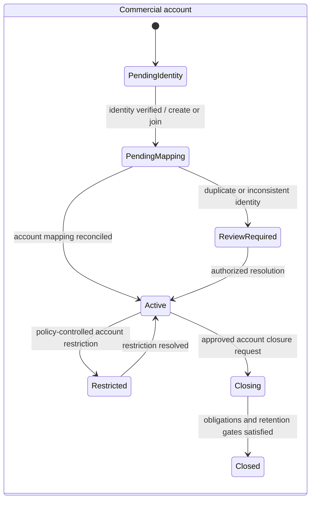
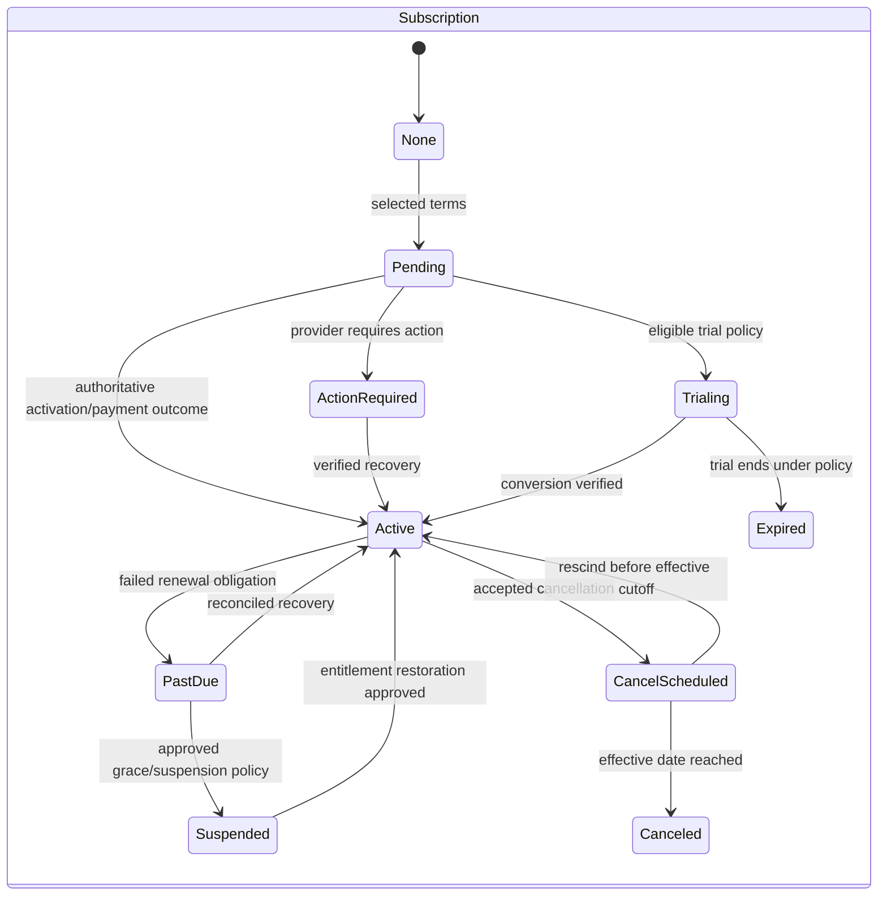
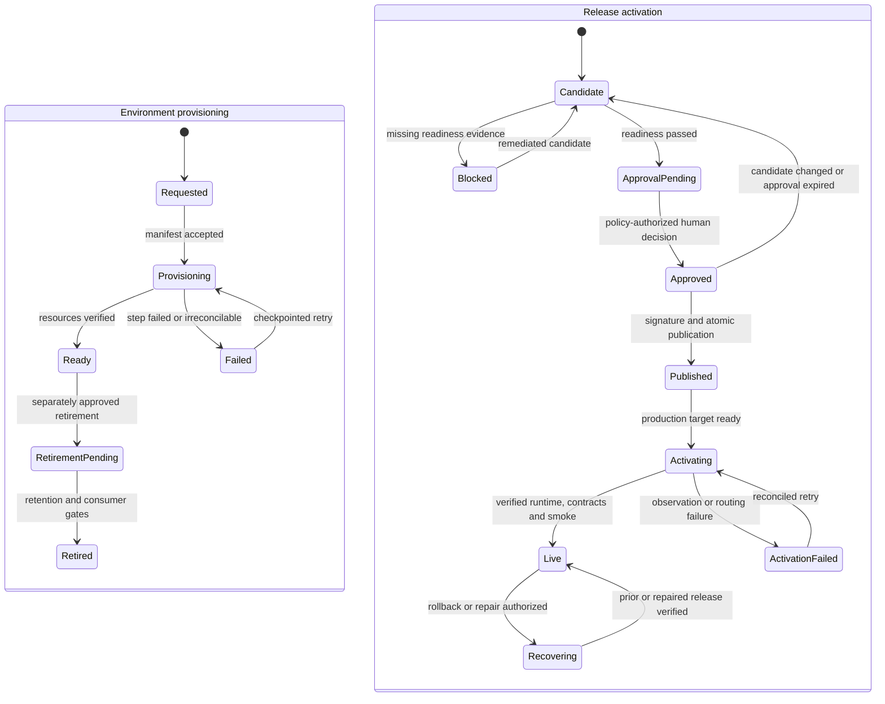

# Self-onboarding experience and interface specification

**Design draft 0.1 · 6 September 2026 · not accepted · not implemented.** This document advances M4 for engineering refinement. It does not claim the onboarding service exists, select providers, assign named owners, authorize purchases/deployment, or close M4. Proposed commands, routes, payloads and states below are design contracts to review; they must not appear in published OpenAPI as implemented endpoints until they run.

M4 delivery target: Saturday 12 September 2026, Asia/Jerusalem. Source: the six experience areas and interface/design handoff in [September milestones v1.0](../source/Facio_Kernel_Milestones_September_2026.txt), with tenancy, publication and commercial ownership from the [development requirements](../source/Facio_Insurance_Kernel_Development_Requirements_v1.0.txt) and [source-of-truth plan](../source/Facio_Kernel_Deployment_and_Source_of_Truth_Plan_v1.0.txt). This draft covers the experience and interfaces; all provider choices, commercial terms and production-readiness claims remain explicit decisions.

## Journey and ownership

The customer signs in, establishes an organization/commercial account, selects an eligible plan, configures a tenant in a sandbox, validates a release, then requests governed live activation. Returning users resume the persisted account journey. Test data is never promoted into production as part of activation. Existing customers use verified account mappings; onboarding must not create a duplicate commercial account or silently merge organizations.

```mermaid
flowchart LR
  A[Website: explore plans / start / sign in] --> B[Verify identity]
  B --> C[Create or join organization]
  C --> D[Commercial account + membership]
  D --> E[Select plan / payment setup]
  D --> F[Business, product and process intake]
  F --> G[Save draft / validate / resolve gaps]
  E --> H[Choose supported residency]
  G --> H
  H --> I[Provision isolated sandbox]
  I --> J[Default domain or verified customer domain]
  J --> K[Simulate / test / inspect evidence]
  K --> L{Live readiness}
  L -->|Blockers| G
  L -->|Ready| M[Review exact release + human approval]
  M --> N[Publish signed release]
  N --> O[Activate separate production environment]
  O --> P[Verify runtime + contracts + smoke]
  P --> Q[Live account panel]
  Q --> R[Billing / people / domains / support]
  R --> F
  B --> S[Resume saved progress]
  S --> D
```



The website is an experience surface. Identity owns authentication. The designated commercial service owns account/subscription facts. The Control Plane owns tenancy/environment orchestration and consumes commercial entitlements. Kernel configuration services own drafts, validation, simulation and releases. Regional services own insurance transactions and customer PII. A progress projection joins these sources with recorded versions; it is not another editable source of truth.

### Actors and authorization

| Actor | Proposed permissions | Boundary |
| --- | --- | --- |
| Visitor | Public plan/capability reads; start authentication | No account or tenant data |
| Member | Read own profile, permitted account overview, assigned work and own support cases | Membership plus explicit resource permission required |
| Organization owner/admin | Manage organization/members/invitations and onboarding settings | Cannot grant a permission they cannot delegate; last active owner cannot be removed |
| Billing admin | Manage commercial plan, payment method, billing details and invoices | No product publication permission implied |
| Product architect | Draft, import, inspect, validate and simulate configuration | Draft access does not permit production publication |
| Release approver | Review exact diff/evidence and approve under authority policy | Policy controls separation from author, limits and expiry; designation TBD |
| Platform operator | Provision/reconcile/recover environments | Does not gain blanket access to regional business data |
| Support agent | Scoped case access; separately approved support session when needed | Time/purpose-bound tenant access, expiry and audit |
| System worker | Narrow service capability and scoped job context | No inferred tenant or authority from arbitrary payload |

Server authorization supplies account/tenant/environment/operating-entity/actor/permission/correlation context. Resource IDs in routes are lookup targets, not authority grants. UI and MCP use the same authorized command paths. Account switching first verifies membership and then creates the new authorized context; it does not accept a tenant identifier as a trusted model field.

## Screen conventions and action contract

Every screen uses a persistent organization/environment header, progress status, save status and support entry. Show “Draft”, “Sandbox” and “Live” clearly. A single primary action advances the current step; the user can return to completed steps without losing server-saved progress. Unsaved fields show a dirty indicator and a recoverable navigation warning. A published release view is read-only; edits start or resume a draft.

The annotated wireframes below define hierarchy and behavior for design refinement. They are not approved visual designs.

```text
ONBOARDING WORKSPACE                       ACCOUNT PANEL
[Organization ▾] [Sandbox] [Help]          [Organization ▾] [Environment ▾] [Help]
[Identity ✓] [Plan] [Configure] [...]      [Overview] [People] [Billing] [Domains] [Support]
Title + saved timestamp                    Account / subscription / environment status
What is needed to continue                 Key action or service-status notice
Fields / editable configuration            Current details and recent activity
Inline errors + source reference           Table/list with explicit empty state
Readiness issues with owners               Contextual detail / invoice / request panel
[Back] [Save draft] [Validate / Continue]   [Primary action] + safe secondary actions
```

Apply these conventions to **every action row** below:

- **Validation:** browser hints are advisory; the owning service validates typed fields, scope, state, permission and expected resource revision. Errors preserve input and identify the field or deterministic blocker. A revision conflict offers reload/diff; it never overwrites another user's work silently.
- **Loading:** distinguish initial load, saving, external handoff and background work. Disable duplicate action submission while the command is pending; retain the same idempotency key for uncertain retries. Long work returns an operation ID with resumable progress.
- **Empty/denied/error:** explain no data versus missing permission versus failed load; never render unknown configuration or payment status as complete/paid. Denied access shows a safe reason and access-request/support route without leaking resource details.
- **Recovery:** show next action, retained progress and retry status. Reconcile uncertain outcomes before repeating side effects. Correlation/support reference is copyable; provider secrets and internal stack traces are hidden.
- **Mobile/accessibility:** single-column fields, summary before details, responsive table-to-card alternative, visible labels, keyboard order/focus restoration, non-color status text, announced async results and error summary linked to fields. Dialogs trap/restore focus; critical controls remain reachable at zoom; upload supports keyboard/file chooser and is not drag-only. No permission or billing decision relies only on a tooltip.

## 1. Website entry and identity

| ID / screen and action | Actor / preconditions | Fields and validation | Proposed command → resulting state | Specific states / recovery |
| --- | --- | --- | --- | --- |
| ID-01 Entry: explore plans / start | Visitor; public release/capability catalog available | Locale; optional selected plan reference must be current | `GetPublicPlans`, `StartOnboarding` → anonymous session reference with selected plan intent | No plan available: explain contact path; catalog failure: no fabricated price/capability |
| ID-02 Sign up / sign in / sign out | Visitor or authenticated user | Provider-hosted identity input; redirect state/nonce and allowed return URL | `BeginAuthentication`, `CompleteAuthentication`, `EndSession` → authenticated/ended session | Expired/canceled provider flow preserves onboarding intent; invalid callback rejected; no password storage by Kernel |
| ID-03 Verify identity / resend | Authenticated unverified user | Provider verification token; expiry and resend policy | `RequestVerification`, `ConfirmVerification` → verified identity or pending | Expired/already-used token shows safe resend; avoid identity enumeration; gated actions remain blocked |
| ID-04 Recover account / session | User with expired/lost session | Provider-controlled recovery challenge | `BeginRecovery` → provider recovery; resume only after authenticated read | Never bypass verification using URL account ID; shared-device signout removes session data |
| ID-05 Organization: create | Verified identity; no selected authorized organization | Organization display/legal name, country, business contact, locale/timezone; duplicates flagged for resolution | `CreateCommercialAccount` → pending/active account and owner membership, correlated CRM mapping request | Existing match: authorized join/review route, not silent merge; partial CRM sync shown pending |
| ID-06 Join / accept invite / choose account | Authenticated verified invitee or member | Signed invite token, intended email, expiry; account selection checked against memberships | `AcceptInvitation`, `SelectAuthorizedAccount` → active membership/context | Wrong identity, revoked/expired invite, absent membership: safe retry or request access |
| ID-07 Invite / resend / revoke | Organization admin with delegation permission | Invitee email, role set, optional operating-entity scope; no privilege escalation | `InviteMember`, `ResendInvitation`, `RevokeInvitation` → invited/revoked membership request | Duplicate invitation shows existing state; send failure tracked; revoke invalidates token |
| ID-08 Resume on return | Verified member | No client-supplied progress authority; authorized account selection | `GetOnboardingProgress` → latest server projection with next permitted action | Stale session resumes after login; missing prerequisites link to owning step; failed projection shows last verified timestamp |

## 2. Plan, subscription and billing

| ID / screen and action | Actor / preconditions | Fields and validation | Proposed command → resulting state | Specific states / recovery |
| --- | --- | --- | --- | --- |
| BILL-01 Compare / select plan | Owner/billing admin; mapped commercial account | Plan/version, billing interval/currency, quantities, region-compatible entitlements; only published terms | `PreviewSubscription`, `SelectPlan` → quoted intent / pending activation | Display included limits and unavailable options; expired quote refreshes terms before confirmation |
| BILL-02 Start trial, if offered | Eligible authorized account; trial policy exists | Selected trial/version and acknowledged conditions | `StartTrial` → trialing subscription with explicit end/entitlement policy | Trial absent/ineligible hides action with explanation; no invented trial length or card requirement |
| BILL-03 Billing details / tax identity | Billing admin | Legal bill-to name/address/country, tax identifiers, contact and invoice preference; jurisdiction validation | `UpdateBillingProfile` → versioned billing profile | Invalid/pending tax verification visible; no guessed tax treatment; retry retains draft |
| BILL-04 Add / replace payment method | Billing admin; provider session authorized for account | Hosted payment-method token only; no raw card/bank fields in Kernel | `CreatePaymentSetupSession`, `ConfirmPaymentSetup` → pending/verified method reference | Browser return is not payment proof; delayed provider event shows verifying; duplicate callback reconciled |
| BILL-05 Confirm subscription / charge | Billing admin; current quote/profile/method and permitted terms | Quote/version, terms acceptance, idempotency key; fresh commercial totals | `ConfirmSubscription` → pending payment / active / action-required | Unknown payment result stays pending; request further provider action without charging again |
| BILL-06 Invoices: view / download | Billing admin or invoice-read permission | Invoice ID; owning account scope and immutable invoice version | `ListInvoices`, `GetInvoiceDownload` → scoped invoice/read link | Empty: no invoices issued; expired link regenerates; inaccessible invoice not leaked |
| BILL-07 Renewal / upgrade / downgrade | Billing admin; eligible current subscription | Target plan/version, effective timing, quoted proration and impact | `PreviewPlanChange`, `ConfirmPlanChange` → scheduled/immediate change per approved commercial policy | Show limits/features affected and price before confirm; jobs reconcile effective-date changes; no assumed proration rule |
| BILL-08 Cancel / rescind scheduled cancellation | Billing admin with cancellation permission | Effective timing, reason, acknowledged access/data implications | `ScheduleCancellation`, `RescindCancellation` → cancel-scheduled / prior valid state | In-force policy servicing and data-retention duties survive commercial cancellation according to approved policy |
| BILL-09 Failed-payment recovery / retry | Billing admin; failed/action-required payment | New verified method or provider action; existing obligation/payment attempt reference | `RecoverSubscriptionPayment` → pending / active / past-due | Prevent duplicate capture; grace/suspension policy TBD; show service impact and support route |

## 3. Configuration journey

| ID / screen and action | Actor / preconditions | Fields and validation | Proposed command → resulting state | Specific states / recovery |
| --- | --- | --- | --- | --- |
| CFG-01 Business/product/process intake | Product architect; sandbox tenant authorized | Entity/licence/territory/currency, typed risk/questions/covers, actors/stages/gates, authority, documents/finance/integration choices | `CreateConfigurationDraft`, `UpdateConfigurationDraft` → new draft revision plus human/machine diff | Required/conditional fields from schemas; unsupported capability → `REQUIRES_ENGINEERING`, not inert accepted data |
| CFG-02 Upload / map source | Architect; permitted file type/size/residency | Source file metadata, signed upload reference, category/mapping intent; integrity/type/malware checks | `RequestSourceUpload`, `RegisterSource`, `ExtractDraftProposal` → quarantined/ready source and proposed changes | Extraction never directly publishes; scan/extraction errors preserve source reference and retry state; explicit handling of sensitive input |
| CFG-03 LLM/MCP assistance | Architect; authorized session, allowed model/data boundary | Prompt/selected source refs, typed proposed diff; no model identity-context fields | `ProposeDraftChange` via canonical configuration funnel → reviewable proposal | Human inspects source values and errors; rejected/unsupported actions remain visible; provider replaceable |
| CFG-04 Review / apply / undo proposal | Architect; current revision and write permission | Proposal ID, accepted field changes, expected revision | `ApplyDraftProposal`, `RevertDraftChange` → new draft revision/diff/audit | Conflict shows live diff; undo is a new audited change, not history deletion |
| CFG-05 Save / validate / resolve gaps | Architect; typed draft | Draft/revision and validation context; gap remediation values | `SaveDraft`, `ValidateDraft` → saved revision and scoped complete/partial/missing/invalid/unsupported report | Never label unknown as complete; each gap identifies requirement, affected journey, owner/next action |
| CFG-06 Inspect published / compare versions | Permitted member/architect | Release reference and selected draft/release comparison | `GetRelease`, `DiffConfiguration` → immutable effective view and explicit diff | Empty: no release yet; deleted/stale draft ref resolves safely; publication never rewrites history |

## 4. Environment and domain

| ID / screen and action | Actor / preconditions | Fields and validation | Proposed command → resulting state | Specific states / recovery |
| --- | --- | --- | --- | --- |
| ENV-01 Choose residency/topology | Owner/platform permission; eligible subscription | Supported region/topology/tier, environment kind, retention/DR choice; license/data-flow/entitlement compatibility | `PreviewEnvironment`, `RequestEnvironment` → requested manifest and operation | Unsupported region is a tracked request, not simulated availability; region move is a separate migration, not an editable label |
| ENV-02 Provision / inspect / retry | Platform service; approved manifest/context | Manifest version, environment ref and operation ID | `ProvisionEnvironment`, `GetProvisioningOperation`, `RetryProvisioning` → provisioning/ready/failed | Idempotent step checkpoints; orphan resources inventoried; retry reconciles existing resources before creation |
| ENV-03 Use default URL | Member with environment read | Allocated hostname and verified routing state | `GetEnvironmentAccess` → ready scoped default URL | Show pending DNS/TLS until verified; a URL string alone is not readiness |
| ENV-04 Add customer domain / verify | Domain admin; entitled environment | Canonical hostname, ownership token, routing target; reserved/conflicting names rejected | `RequestDomain`, `VerifyDomainOwnership` → verification-pending/verified | Copyable DNS instructions, observed record/time, retry action; neither DNS credentials nor registrar access assumed |
| ENV-05 Activate routing / inspect TLS | Platform service plus approved domain binding | Verified domain/environment binding and certificate order reference | `ReconcileDomainBinding` → DNS-pending/TLS-pending/active/failed | No route to other tenant; certificate failure retains working default URL; retries rate/circuit controlled |
| ENV-06 Remove / replace domain | Domain admin; dependency and current-use checks | Domain ref, replacement/default route, acknowledged impact | `RetireDomainBinding` → retirement-pending/retired | Prevent orphaned customer links; drain/cache and certificate cleanup tracked; preserve audit/history |

## 5. Draft/test to Live

| ID / screen and action | Actor / preconditions | Fields and validation | Proposed command → resulting state | Specific states / recovery |
| --- | --- | --- | --- | --- |
| LIVE-01 Seed isolated test data / run simulation | Architect/test permission; ready sandbox | Approved synthetic fixture/scenario IDs, draft revision, non-production integration profile | `RunConfigurationSimulation` → queued/running/passed/failed evidence | Side effects disabled or explicitly simulated; results show paths/decisions/docs/money/blockers and version |
| LIVE-02 View readiness / fix blocker | Architect/approver; candidate assembled | Candidate digest and target environment; server gathers required evidence | `EvaluateLiveReadiness` → ready/blocked report with gate IDs | Link each blocker to its remediation and owner; unknown mandatory evidence fails closed |
| LIVE-03 Request approval / review / approve or reject | Architect requests; authorized human approver decides | Exact release digest, diff/evidence refs, exceptions, target/effective date; authority policy | `RequestReleaseApproval`, `DecideReleaseApproval` → pending/approved/rejected | Any candidate change invalidates approval binding; expiry/revocation explicit; author-approval separation follows chosen policy |
| LIVE-04 Publish candidate | Publication service; valid approval and all gates | Approved digest, immutable versions, signature key reference/effective date/rollback pointer | `PublishTenantRelease` → signed immutable published release | Atomic publication; failed signing/persistence leaves no partially active release; credentials alone cannot approve |
| LIVE-05 Activate / inspect progress | Authorized activation service; published candidate and ready production manifest | Release+manifest digests, target environment, activation idempotency key | `ActivateTenantRelease` → activating/active/failed | Production resources are distinct from sandbox data; staged routing, single writer, observed runtime/hash/smoke verification before active |
| LIVE-06 Recover / roll back release | Authorized operator/approver per incident policy | Activation operation, prior valid release, reason and post-activation-write assessment | `RecoverActivation`, `ActivatePreviousRelease` → recovering/active previous release or failed | Preserve transactions already governed by new release; never restore old test/production snapshot over new writes |

## 6. Customer account panel

| ID / screen and action | Actor / preconditions | Fields and validation | Proposed command → resulting state | Specific states / recovery |
| --- | --- | --- | --- | --- |
| ACCT-01 Overview / status / service notifications | Authorized member | Current account/subscription/environment/domain/release projection and verification timestamps | `GetAccountOverview` → joined read-only statuses and allowed actions | Stale/unknown source marked; service incident distinct from billing suspension; no false “Live” from saved settings |
| ACCT-02 Edit own profile / preferences | Member | Display/contact/locale/timezone and notification preferences; reverify identity contact changes | `UpdateMemberProfile` → versioned profile/preferences | Identity-owned facts updated via identity interface; preferences do not disable mandatory service notices unless policy permits |
| ACCT-03 Manage organization / roles / remove member | Owner/admin | Organization metadata, membership/role/entity scope; delegation and last-owner checks | `UpdateOrganization`, `ChangeMembership`, `RemoveMembership` → updated/revoked membership | Revoke sessions/grants where required; pending jobs reauthorize; owner transfer is explicit and audited |
| ACCT-04 Billing / environment / domain servicing | Authorized billing/domain/platform role | References to existing resources | Reuse BILL-03–09 and ENV-03–06; no alternative mutation path | Same permissions, idempotency, status and recovery as onboarding |
| ACCT-05 Create service/support request | Permitted member | Category, subject, description, environment/release ref, safe attachment refs, contact preference | `CreateSupportRequest` → open case and acknowledgement | Filter secret/PII oversharing; case remains available if notification fails; no unsolicited support access grant |
| ACCT-06 View / reply / close / reopen request | Authorized case participant | Case ID/revision, message/attachment refs, resolution feedback | `AddSupportMessage`, `ResolveSupportRequest`, `ReopenSupportRequest` → waiting/resolved/reopened case | Message deduplication; delivery state separate; closed case history immutable |
| ACCT-07 Review support access request | Owner with support-grant authority | Agent/purpose/environment/scope/expiry; explicit consent | `DecideSupportAccess`, `RevokeSupportAccess` → approved/rejected/expired/revoked grant | Readable exact scope/duration; automatic expiry and complete audit; access not implied by opening a ticket |

## Account, subscription and environment state models

These are separate state machines. Billing status never edits policy transaction state, and provisioning success never implies release approval. Transition commands are authorized and revision-checked by their owning service. The customer-facing overview projects these states with timestamps.







Domain binding has its own progression: `requested → ownership_pending → ownership_verified → routing_pending → tls_pending → active`, with `failed` carrying the failed step and a retry path, and `retirement_pending → retired` for removal. The default domain may satisfy activation when a custom domain remains pending only if the approved account/product policy permits it; that is an explicit readiness result.

## Common interface envelope

The proposed public protocol uses authenticated resource routes, strict schemas and typed errors. Examples below describe contracts, not deployed routes. Production authentication mechanism and provider protocol choices require review. Keep identity secrets and payment credentials in their owning provider; store references only.

```json
{
  "commandId": "opaque-id",
  "type": "RequestEnvironment",
  "schemaVersion": "1",
  "resourceId": "authorized-resource-reference",
  "expectedRevision": 7,
  "payload": {"manifestReference": "approved-manifest-reference"}
}
```

`Idempotency-Key` is scoped to authenticated principal/account, operation and resource. Same key plus same payload returns the original result; same key with different payload yields `IDEMPOTENCY_CONFLICT`. Expiry/retention is an explicit per-operation policy long enough for the external obligation's retry/reconciliation period, not a guessed universal TTL. Payment and provisioning operation identifiers remain durably unique beyond HTTP retry windows.

The server adds `{accountId, tenantId?, operatingEntityId?, environmentId?, actorId, permissionSet, correlationId}` as authorized context; these are not model-supplied authority fields. Domain events add `eventId`, `type`, `schemaVersion`, `aggregateId`, `aggregateVersion`, `occurredAt`, `correlationId`, `causationId`, source and scope. Minimize event PII and keep regional evidence behind authorized references.

Command success returns `{resourceId, revision, state, operationId?, diff?, links}`. Failure returns `{code, message, fields?, blockers?, retryable, correlationId}`. Proposed HTTP conventions: `400/422` invalid input/domain blocker, `401` unauthenticated, `403` forbidden, `404` non-disclosing unavailable resource, `409` stale revision/idempotency conflict, `429` throttled with retry guidance, `503` temporary dependency failure. Asynchronous accepted work returns an operation reference; accepted work is not completed work.

## Provider-neutral interface catalogue

Each row must become a reviewed schema/operation descriptor before implementation. Proposed route namespaces are illustrative contracts for engineering refinement. Public HTTP and MCP descriptors share domain schemas; protocol differences remain explicit. Outbound messages are worker-produced events, not permission for an assistant to contact others.

| Interface / system of record | Proposed API / minimum payload | Authentication and events | Idempotency / retry / reconciliation |
| --- | --- | --- | --- |
| **Identity**: selected identity service owns credentials, verification, subject and sessions; account service owns membership | `BeginAuthentication`, `ConfirmVerification`, `GetIdentity`; subject, verified claims, session assurance, allowed return URI | Standard federated/session protocol selected later; signed callback/state checks; `identity.verified`, `identity.contact_changed`, `session.revoked` | Provider callback/event ID inbox; expired flow restarts safely; reconcile subject→member mapping without duplicating account |
| **Control Plane**: tenant/environment desired state and onboarding operation owner; no unnecessary policyholder PII | Proposed `/v1/onboarding`, `/v1/environments`; account mapping ref, environment kind, region/topology, manifest ref, operation status | Authenticated human/service permissions; `tenant.requested`, `environment.provisioning`, `environment.ready/failed`, `activation.*` | Unique account/environment intent; durable outbox and operation checkpoints; retries observe resources first; desired-vs-observed registry reconciliation |
| **Kernel configuration / MCP**: draft/version/validation/simulation/release owning services | Proposed `/v1/configuration/*` plus typed MCP discover/inspect/draft/validate/diff/simulate/request approval/publish; revision, source refs, typed diff, candidate digest | Server-injected tenant/entity/authority; provider-independent MCP auth; `configuration.draft_changed`, `simulation.completed`, `release.approved/published` | Revision concurrency; mutation key+digest; audit/provenance; immutable hash parity across UI/HTTP/MCP and effective runtime |
| **Payment**: selected payment service/provider owns payment instrument and authoritative payment outcome; commercial finance owns obligation mapping | `CreatePaymentSetupSession`, `ConfirmPayment`, `GetPayment`; obligation ID, amount/currency, payer account, provider reference and safe return URI | Hosted/tokenized provider interaction; signed verified `payment.succeeded/failed/action_required/refunded` events | Durable obligation/payment-attempt key; no new charge after uncertain response; signed callback inbox; query provider and reconcile totals/status before retry |
| **Subscription / entitlements**: designated commercial service owns plan/subscription/terms; Control Plane owns derived enforceable grant projection | Proposed `/v1/subscription`, `/v1/entitlements`; account/subscription IDs, plan/terms version, status/effective period, quantities, grant version/validity | Billing permission for changes; service-auth event consumption; `subscription.changed`, `entitlements.changed`, `invoice.issued` | Change request ID + expected subscription version; ignore older grant versions; scheduled reconciliation to authoritative owner; grace/expiry policy explicit |
| **Infrastructure provisioning**: version-controlled manifest is intent; orchestration owns operation; cloud/resource registry is observed evidence | `ApplyEnvironmentManifest`, `GetOperation`, `ReconcileEnvironment`; manifest hash, approved region/topology, opaque stores/keys/network refs | Scoped workload identity, provider least privilege; `provisioning.step_completed/failed`, `resource.observed` | Deterministic resource intent IDs, checkpoint ledger; bounded backoff/circuit breaker; inventory orphan/partial resources; no destructive automatic retry |
| **Domain / DNS / TLS**: domain service owns claimed host→environment binding and verification; DNS/certificate providers own observed records/certificates | Proposed `/v1/domains`; hostname, environment ref, proof token/version, expected target, observed proof/time, certificate metadata | Authorized domain admin; scoped service provider access; `domain.verified`, `domain.routing_changed`, `certificate.ready/expiring/failed` | Unique canonical host reservation; token/revision guards; retry propagation with bounded polling; reconcile DNS/TLS/routing and tenant ownership before active |
| **CRM / commercial account mapping**: designate current owner of commercial account/contact/deal facts before changing it; mapping service owns stable cross-system IDs | `ResolveCommercialAccount`, `LinkTenant`, `RecordOnboardingOutcome`; CRM account, subscription, tenant/env/entity references, correlation, mapping revision | Service auth and least data; `account.linked`, `onboarding.stage_changed`; do not copy editable subscription truth | External account ID + stable onboarding key; duplicate resolution queue; retries reconcile mapping before create; database+upload recovery evidence belongs to CRM operations |
| **Support**: selected case service owns case/messages/status; authority service owns temporary support grants | Proposed `/v1/support/cases`, `/v1/support/access-requests`; subject/category, authorized context refs, safe messages/attachments, purpose/scope/expiry | Case participant permission; explicit approved support grant for tenant access; `case.created/updated/resolved`, `support_grant.*` | Client message/request ID; deduplicate retries; case delivery separate from notification; reconcile external ticket mapping/status without losing history |
| **Notifications**: communications owner owns template, recipient/consent/delivery record; preferences service owns user choice | `QueueNotification`; event ref, template/version, language, authorized recipient reference, secure action link | Service-only send permission and signed provider callbacks; `notification.queued/delivered/failed` | Event+template+recipient+channel uniqueness; bounded retry/DLQ; reconcile provider delivery, never re-run business command to resend; no PII in generic event logs |
| **Experience / website projection**: read model joins authoritative state; owns navigation/presentation only | Proposed `/v1/account/overview`, `/v1/onboarding/progress`; scoped source versions, verification times, next permitted actions and blockers | Member session + resource permissions; consumes above events | Version-aware projection, replayable from sources; stale indicator on lag; read-through reconciliation for high-impact actions; never locally marks subscription paid or environment live |

For every inbound webhook: verify signature/source and replay window, persist received event ID, apply scope mapping, enforce monotonic aggregate/version semantics where provided, then dispatch the canonical use case. Acknowledge safely accepted events independently of downstream completion. Unmapped, out-of-order or invalid events go to an owned exception workflow; no fallback tenant is allowed.

For every outbound integration: retain operation/correlation identity, classify retryable/permanent failures, use bounded exponential backoff with jitter, durable queue/outbox and DLQ, and record next retry/owner. Exact retry budgets, signature algorithms, key rotation and reconciliation intervals are decisions. External timeouts are uncertain outcomes until queried; they do not automatically justify repeating a charge or provisioning action.

## Draft/test-to-Live gate matrix

Readiness binds evidence to the exact candidate and target manifest. Recheck mutable prerequisites immediately before activation. A gate is `passed`, `blocked` or `unknown`; mandatory unknowns block. Exceptions require a named authorized decision with scope/expiry; a UI checkbox alone cannot waive a gate.

| Gate / blocker code | Required evidence and owning concern | Actor / remediation |
| --- | --- | --- |
| LIVE-G01 `IDENTITY_OR_MEMBERSHIP_UNVERIFIED` | Verified actor; active organization membership, authority and account/tenant/entity mapping | Identity/account owner resolves verification or mapping |
| LIVE-G02 `COMMERCIAL_ENTITLEMENT_UNSATISFIED` | Authoritative permitted plan/status, current grant version, valid effective window and required payment outcome | Billing owner resolves pending/action-required payment; approved trial/grace behavior explicitly evaluated |
| LIVE-G03 `CONFIGURATION_NOT_VALIDATED` | Typed references, required fields, authority/dates/territory, finance/docs/process consistency on candidate digest | Architect follows requirement-linked gap remediation |
| LIVE-G04 `REQUIRES_ENGINEERING` | Registered executable capability/extension and contract/golden evidence; no unsupported required algorithm | Engineering implements/tests or scope owner approves a valid alternative; no inert config acceptance |
| LIVE-G05 `SIMULATION_OR_REGRESSION_FAILED` | Required happy/referral/decline/failure/service scenarios and golden outputs for declared capability | Architect/test owner fixes and reruns exact candidate; simulation is isolated |
| LIVE-G06 `APPROVAL_MISSING_OR_STALE` | Policy-controlled named human approval of diff/evidence/exceptions, target, digest and effective time | Authorized approver reviews; candidate edits/expired authority invalidate approval |
| LIVE-G07 `RELEASE_NOT_SIGNED_OR_PUBLISHED` | Atomic immutable release, signature/checksum, exact component versions and rollback reference | Release service/operator repairs publication; cannot activate draft |
| LIVE-G08 `RESIDENCY_OR_SECURITY_UNVERIFIED` | Selected topology/region covers data/replicas/backups/logs/integrations; least privilege, isolation, key/secret/provider scope checks | Platform/security owner provides evidence; no region inference from account country |
| LIVE-G09 `PRODUCTION_ENVIRONMENT_NOT_READY` | Manifest/resource observations, database/schema/queues/storage readiness, tenant mapping, separate test data | Platform operator reconciles provision operation; no sandbox data promotion |
| LIVE-G10 `DOMAIN_NOT_READY` | Approved reachable domain, tenant routing, ownership and valid TLS; default-domain fallback allowed only by policy | Domain owner verifies DNS/TLS or selects permitted default domain |
| LIVE-G11 `INTEGRATION_NOT_READY` | Required production adapters/credential refs/provider scopes and acknowledged boundary tests | Integration owner repairs provider setup; simulated provider cannot silently satisfy production readiness |
| LIVE-G12 `RECOVERY_OR_OPERATIONS_UNREADY` | Restore/recovery objectives, backup test, one-writer/replay plan, health/alerts/support owners | Operations owner supplies runbook/evidence and approved activation window |
| LIVE-G13 `CONTRACT_DRIFT` | Exact Kernel/configuration/OpenAPI/MCP/catalog/docs hashes and supported capability parity | API/platform owner resolves mismatch; prior docs remain truthful until matched runtime verified |
| LIVE-G14 `POST_ACTIVATION_VERIFICATION_FAILED` | Authenticated runtime identity, served hashes, representative smoke/data, telemetry and registry reconciliation | Activation remains failed/recovering; operator repairs or safely activates prior release preserving writes |

## Exception and recovery catalogue

| Exception | User-visible state / retained progress | Recovery / owner |
| --- | --- | --- |
| Login or verification expires mid-onboarding | Session expired; saved step intact; sensitive local data cleared | Reauthenticate and reload authorized progress; identity owner |
| Duplicate organization / CRM unavailable | Account review or mapping pending; no duplicate account silently created | Reconcile stable external IDs, request authorized resolution; commercial owner |
| Invite sent to wrong identity / last owner removal | Join/role change denied with safe explanation | Correct/reissue invite or explicit owner transfer; organization admin |
| Concurrent draft or billing edit | Conflict with current revision and diff; unsent values retained | Reload/merge and resubmit new command; owning editor |
| Unsupported product algorithm / unresolved field | Named gap and affected journey, saved draft still available | Typed extension requirement with source/owner; engineering |
| Upload scan, format or extraction fails | File quarantined/rejected; no values silently applied | Replace file or retry permitted extraction; user + data/security owner |
| Provider payment succeeds but callback/browser fails | Verifying payment; obligation ID visible; activation blocked pending truth | Query/reconcile provider once; do not charge again; billing owner |
| Duplicate/out-of-order webhook | Processing/reconciling state; no repeated side effect | Durable inbox/version guards and authoritative read; integration owner |
| Subscription lapses during approval/activation | Readiness becomes blocked; candidate and approval history retained | Recheck entitlement, resolve billing; no destruction of in-force servicing records |
| Requested region unavailable / capacity partial | Requested or failed provisioning, supported alternatives shown without auto-migration | Reconcile partial resources; owner chooses approved alternative; platform |
| Domain conflict / DNS propagation / TLS failure | Verification/routing/certificate pending with last check and next action | Correct DNS or use policy-permitted default; preserve existing safe route |
| Candidate changes after approval | Approval stale; previous decision retained; activation blocked | Validate/review exact new digest; architect + approver |
| Simulation accidentally configured with live adapter | Test execution denied before external effect | Select sandbox/simulated profile; integration owner |
| Activation times out after routing begins | Activating/reconciling, never presumed failed-and-safe-to-repeat | Observe current writer/runtime and operation ledger; reconcile before retry/rollback |
| Post-activation failure with new transactions | Recovering; release-specific transactions remain addressable | Forward repair or prior release activation with write-preserving plan; operator/incident owner |
| Notification fails after business command | Command completed, notification retry pending | Retry delivery only; user can inspect same case/invoice/release in panel |
| Support needs elevated access | Awaiting explicit scoped approval, case remains open | Owner approves/rejects time/purpose scope; access expires automatically |
| Cancellation while policies/data obligations remain | Commercial cancellation scheduled; servicing/retention impact shown | Approved entitlement/retention policy governs access; no automatic business-data deletion |

## Decisions, owners and review evidence

| Decision ID | Missing input / named owner | Required review |
| --- | --- | --- |
| ONB-D01 | Product acceptance owner, UX lead, engineering lead, CRM/billing/platform/security/support maintainers not named | Assign accountable people and review capacity; proposed functions are not assignments |
| ONB-D02 | Identity provider, MFA/SSO assurance and account recovery model | Select protocol/provider and verification/delegation policy |
| ONB-D03 | Current CRM/account/subscription/billing writer and identifier mappings | Trace existing production truth before choosing future service boundaries; preserve database/uploads |
| ONB-D04 | Plans/prices/currencies/intervals/limits, trial, proration, tax and invoice obligations | Approved commercial catalog and billing state policy; no assumed amounts or trial period |
| ONB-D05 | Payment ownership/provider, methods, confirmation/refund/dispute and failed-payment behavior | Hosted setup/authenticated webhook contract; grace, suspension and in-force servicing policy |
| ONB-D06 | Supported residency/topologies, data stores/keys/retention/DR/SLO/RPO/RTO and provisioning access | Region-specific operational and security acceptance; no unselected cloud resources |
| ONB-D07 | Domain providers, default-domain availability, custom-domain entitlement and TLS ownership | Host uniqueness/routing/renewal/retirement policy and fallback rules |
| ONB-D08 | Production authority, separation of author/approver, approval expiry, exceptions and emergency activation | Review policy and auditable decision schema; no MCP bypass |
| ONB-D09 | Supported initial products/processes and completeness/simulation evidence required per journey | Reuse M3 catalog/gaps; customer discovery remains separately authoritative |
| ONB-D10 | CRM/support/notification providers, recipient/consent policies, support access and retention | Payload minimization, authentication and delivery/reconciliation contracts |
| ONB-D11 | Idempotency retention, event ordering, retry/DLQ budgets, reconciliation intervals and alert owners | Per-operation failure/recovery decisions informed by provider contracts |
| ONB-D12 | Mobile breakpoints, localization/languages and accessibility acceptance standard | UX review of annotated screens and keyboard/error/recovery walkthrough |

Review checkpoints from the milestone baseline: September 7 journey/interface outline; September 9 screen and ownership review; September 10 billing/domain/Live failure review; September 11 Product/UX/Engineering review with Platform/Billing; September 12 final M4 acceptance. No review or approval is recorded by writing this draft.

Before M4 can be accepted, reviewers must trace website entry through live operation and account servicing across the map, every screen/action, the independent state models, every external interface, Live gates and exceptions. Each open provider/owner decision must either be resolved or explicitly bounded in the engineering handoff with a decision owner/date. Annotated visual designs and representative keyboard/mobile/error journeys must be reviewed; this text draft is a starting contract for that work, not a claim those reviews passed.
